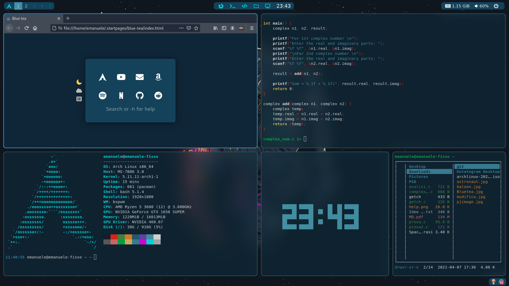

### BSPWM SpaceBlue

**Note:**

This is my first configuration of bspwm made on Archlinux. Please look at screenshot section to see how it looks.

### NECESSARY DEPENDENCIES:
**wm:**
- bspwm-rounded-corners-git
- bspwm-undo-git
- bsp-layout-git
- sxhkd-git

**appearance:**
- Teja_Darkest gtk theme
- Qogir cursors 
- ePapirus icon theme

**fonts:**
- ttf-material-icons-git
- ttf-font-awesome 
- ttf-fork-awesome 
- ttf-roboto
- ttf-nerd-fonts-symbols
- ttf-material-icons-git
- otf-font-awesome
- otf-material-icons-git

**necessary utilities:**
- feh
- texted (the amazing editor you see in the picture, install and rate it from https://github.com/Leonia-Tech/texted)
- polybar-git
- my startpage for browser good looking https://github.com/emanuelep57/Blue-tea (star it :D)
- rofi
- rofi-power-menu (check out https://github.com/jluttine/rofi-power-menu)
- pavucontrol
- pulseaudio-control 
- picom-ibhagwan-git 
- Tdrop-git (for dropdown terminal)
- Xterm ( if you want dropdown terminal alacritty doesn't work fine with tdrop)
- papirus-icon-theme-git
- transset-df
- Alacritty
- Xorg (you may use wayland but if you're going to install also xidlehook you may need Xorg)

### OPTIONAL DEPENDENCIES THAT MIGHT HELP
- xidlehook
- redshiftgui-bin 
- numlockx
- betterlockscreen
- xorg-xrandr 
- libxrandr 
- Lxappearance (helps to set gtk themes)
- oh-my-bash
- Alacritty-themes (if you wanna change my alacritty theme)

### PROGRAMS I USE
- c https://github.com/ryanmjacobs/c
- xpdf (pdf reader)
- xorg-xinit
- scrot 
- l3afpad (fork of leafpad)
- VsCodium
- kotatogram-desktop
- qutebrowser and firefox 
- joshuto-git and thunar (file managers)
- qemu, virt-manager and virt-viewer
- tar ,unzip, unrar
- mpv-git and celluloid-git
- paru 
- nvidia 
- nvidia-settings
- bitwarden-bin 
- bpytop 
- discord
- qbittorrent
- bash-pipes
- teams

